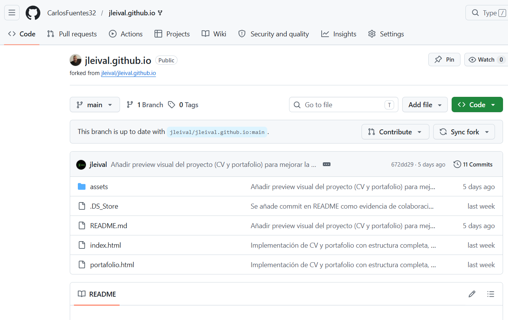
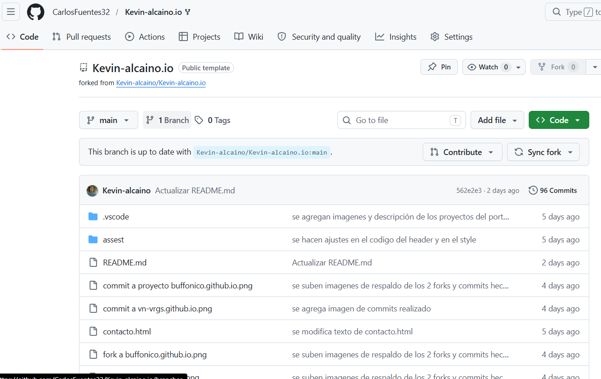

# 👋 Hola, soy Carlos Fuentes

💻 Desarrollador Full Stack JavaScript en formación
📍 San Bernardo, Chile

---

## 🚀 Sobre mí

Profesional con experiencia en ventas, atención al cliente y gestión operativa, actualmente en transición al desarrollo web. Me encuentro cursando un bootcamp de Full Stack JavaScript, enfocado en crear soluciones digitales modernas y funcionales.

---

## 🛠️ Tecnologías

* HTML
* CSS
* Bootstrap
* Git & GitHub

---

## 📂 Portafolio

🔗 [Ver mi portafolio](https://carlosfuentes32.github.io/)

### Proyectos destacados

* 🧾 CV Warren Buffett
* ❤️ Tres Corazones
* 🦎 Iguana Page
* 🎟️ Cuppon

---

## 🔀 FORK Y COMMITS

Durante el desarrollo del portafolio se realizaron forks de repositorios externos y commits correspondientes como evidencia de trabajo con GitHub.

### 📌 Fork 1

Repositorio: `jleival.github.io`

* Se realizó fork del repositorio original
* ✔ Commit realizado:

  * git commit -m "se modifica color de navbar-brand"

📸 Evidencia:
 

---

### 📌 Fork 2

Repositorio: `Kevin-alcaino.io`

* Se realizó fork del repositorio original
* ✔ Commit realizado:

  * git commit -m "se modifica background-color de header"

📸 Evidencia:

---

## 📫 Contacto

📧 [carlosgfuentesrojas@gmail.com](mailto:carlosgfuentesrojas@gmail.com)
📱 +56 9 9502 6368

---

⭐ Actualmente abierto a oportunidades como desarrollador junior.
